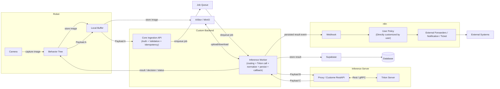

# AI PTTEP

# Payload A-Robot

คำอธิบายตัวแปรหลัก:

- `robot_id`: รหัสหุ่นยนต์ (อาจจะใช้ serial number)
  
- `inference_request_id`: รหัสงาน inference (UUID v5 gen จาก inspection_info)
  
- `mission_execution_id`: รหัสงาน mission (UUID v5)

- `mission_name`: ชื่อภารกิจหรือชื่อหุ่นยนต์

- `timestamp`: เวลาเกิด event ของ payload (ISO-8601 พร้อม timezone)

- `inspection_info`: ข้อมูลจุดตรวจ device_id ใส่  Empty หรือ str() ได้

- `profiling_name`: ชื่อโปรไฟล์เส้นทาง/แผนตรวจ

- `waypoint_id`: รหัส waypoint ที่ตรวจจับ

- `capture_position`: ตำแหน่งย่อยที่ใช้ถ่ายภาพ

- `roi`: รหัส ROI ที่เกี่ยวข้อง

- `inference_task`: ประเภทงานตรวจ

- `inference_payload`: Payload ของ AI แต่ละชนิด

- `0`: digital_gauge_reading

- `1`: analog_gauge_reading

- `2`: abnomality_detection

- `3`: water_level_estimation

- `4`: gas_detection

- `5`: scanning_devices

- `image_uri`: ที่อยู่รูปภาพสำหรับการ infer/อ้างอิงผล

- `camera_info`: สถานะกล้องตอน capture (`sensor`, `pan`, `tilt`, `zoom`)

- `robot_pose`: สถานะหุ่นตอน capture (`rx`, `ry`, `rz`)

- `robot_location`: pose ของหุ่นยนต์ขณะถ่ายภาพ

- `gps_location`: พิกัด GPS จาก `sensor_msgs::msg::NavSatFix`

- `source_topic`: ชื่อ ROS topic ของ GPS

- `timestamp_ns`: เวลาจาก ROS message หน่วย nanoseconds

- `status.status`: สถานะ fix (`-1`, `0`, `1`, `2`)

- `status.service`: ประเภท service ของ GPS receiver

- `latitude`, `longitude`, `altitude`: พิกัดภูมิศาสตร์

- `position_covariance`: covariance matrix 3x3 (9 ค่า)

- `position_covariance_type`: ประเภทความน่าเชื่อถือของ covariance

- `error_magnitude_m`: ค่าความคลาดเคลื่อนโดยประมาณ (เมตร)

```json
{
  "robot_id": "robot_001",
  "inference_request_id": "0daf3458-5cb1-5494-94aa-b2bd0c4a20f9",
  "mission_execution_id": "550e8400-e29b-41d4-a716-446655440000",
  "mission_name": "inspection_001",
  "timestamp": "2026-03-26T19:20:05.112+07:00",
  "inspection_info": {
    "profiling_name": "LKU-E_v4_TEST",
    "waypoint_id": "1",
    "capture_position": "1",
    "roi": "1",
    "device_id": "888--NU-888"
  },
  "inference_task": 0,
  "inference_payload": "{\"threshold_low\":20,\"threshold_high\":80}",
  "image_uri": "s3://robot-1:9090/snapshots/e29963cc-3661-4646-8f7c-a4a149f9464b.png",
  "camera_info": {
    "sensor": "PTZ",
    "pan": 1.5,
    "tilt": 1.2,
    "zoom": 3.0
  },
  "robot_pose": {
    "rx": 0.0,
    "ry": 0.0,
    "rz": 0.0
  },
  "robot_location": {
    "pose": {
      "position": {
        "x": 1.0,
        "y": 2.0,
        "z": 0.4
      },
      "orientation": {
        "x": 0.0,
        "y": 0.0,
        "z": 0.707,
        "w": 0.707
      }
    }
  },
  "gps_location": {
    "source_topic": "/fix01",
    "timestamp_ns": 1774527604026000000,
    "status": {
      "status": 0,
      "service": 1
    },
    "latitude": 13.7563309,
    "longitude": 100.5017651,
    "altitude": 8.42,
    "position_covariance": [
      0.35,
      0.0,
      0.0,
      0.0,
      0.41,
      0.0,
      0.0,
      0.0,
      1.2
    ],
    "position_covariance_type": 2,
    "error_magnitude_m": 0.872
  }
}


```

# Payload A-CCR

คำอธิบายตัวแปรหลัก:

- `inference_request_id`: รหัสงาน inference (UUID gen จาก timestamp)

- `timestamp`: เวลาเกิด event ของ payload (ISO-8601 พร้อม timezone)

- `inference_task`: ประเภทงานตรวจ

- `inference_payload`: Payload ของ AI แต่ละชนิด

- `0`: digital_gauge_reading

- `1`: analog_gauge_reading

- `2`: abnomality_detection

- `3`: water_level_estimation

- `4`: gas_detection

- `5`: scanning_devices

- `image_uri`: ที่อยู่รูปภาพสำหรับการ infer/อ้างอิงผล

```json
{
  "inference_request_id": "0daf3458-5cb1-5494-94aa-b2bd0c4a20f9",
  "timestamp": "2026-03-26T19:20:05.112+07:00",
  "inference_task": 2,
  "inference_payload":  {\"threshold_low\":20,\"threshold_high\":80},
  "image_uri": "s3://robot-1:9090/snapshots/e29963cc-3661-4646-8f7c-a4a149f9464b.png"
}


```

# Payload B

คำอธิบายตัวแปรหลัก:

- `inference_request_id`: รหัสงาน inference (UUID v5 gen จาก inspection_info)
- `timestamp`: เวลาเกิด event ของ payload (ISO-8601 พร้อม timezone)
- `inference_task`: ประเภทงานที่ส่งไป inference
- `inference_payload`: Payload ของ AI แต่ละชนิด
- `image_uri`: ที่อยู่รูปภาพ input
- `model`: ชื่อโมเดลที่ใช้ inference

รายการ `inspection_task` ที่ใช้อยู่:

- `0`: digital_gauge_reading

- `1`: analog_gauge_reading

- `2`: abnomality_detection

- `3`: water_level_estimation

- `4`: gas_detection

- `5`: scanning_devices

```json

// Payload B

// Endpoint: http://inference-server:8080/infer

{
"inference_request_id": "0daf3458-5cb1-5494-94aa-b2bd0c4a20f9",
"timestamp": "2026-03-26T19:20:05.112+07:00",
"inference_task": 2, // abnomality_detection
"inference_payload":null
"image_uri": "s3://robot-1:9090/snapshots/e29963cc-3661-4646-8f7c-a4a149f9464b.png",
"model": "abnormality_v4"
}

  

// Payload B - gauge_reading

{
"inference_request_id": "0daf3458-5cb1-5494-94aa-b2bd0c4a20f9",
"timestamp": "2026-03-26T19:20:05.112+07:00",
"inference_task": 0, // digital_gauge_reading,
  "threshold_low": 20, "threshold_high": 80
"inference_payload":  {\"threshold_low\":20,\"threshold_high\":80},
"image_uri": "s3://robot-1:9090/snapshots/e29963cc-3661-4646-8f7c-a4a149f9464b.png",
"model": "gauge_v4"
}

  

// Payload B - analog_gauge_reading

{
"inference_request_id": "0daf3458-5cb1-5494-94aa-b2bd0c4a20f9",
"timestamp": "2026-03-26T19:20:05.112+07:00",
"inference_task": 1, // analog_gauge_reading
"inference_payload": {\"threshold_low\":20,\"threshold_high\":80},
"image_uri": "s3://robot-1:9090/snapshots/e29963cc-3661-4646-8f7c-a4a149f9464b.png",
"model": "gauge_v4"
}

  

// Payload B - water_level_estimation

{
"inference_request_id": "0daf3458-5cb1-5494-94aa-b2bd0c4a20f9",
"timestamp": "2026-03-26T19:20:05.112+07:00",
"inference_task": 3, // water_level_estimation
"inference_payload":null
"image_uri": "s3://robot-1:9090/snapshots/e29963cc-3661-4646-8f7c-a4a149f9464b.png",
"model": "water_level_v7"
}

  

// Payload B - gas_detection

{
"inference_request_id": "0daf3458-5cb1-5494-94aa-b2bd0c4a20f9",
"timestamp": "2026-03-26T19:20:05.112+07:00",
"inference_task": 4, // gas_detection
"inference_payload":null
"image_uri": "s3://robot-1:9090/snapshots/e29963cc-3661-4646-8f7c-a4a149f9464b.png",
"model": "gas_detection_v12"
}

```

## AI pipeline : Robot



## AI pipeline - CCR

```mermaid

flowchart LR

%%subgraph Robot
%%direction LR
%%Camera[Camera] -->|capture image| BT[Behavior Tree]
%%Buffer[Local Buffer]
%%end

subgraph CCR["CCR / Control Station"]
direction LR
Operator[Operator] --> GUI["CCR Software GUI"]
end

subgraph Backend["Custom Backend"]
direction LR
Ingress["Core Ingestion API<br/>(Auth + Validation + Idempotency)"]
Worker["Inference Worker<br/>(routing + Triton call + normalize + persist + callback)"]
end

subgraph Inference["Inference Server"]
direction LR
Proxy[Proxy / Custome RestAPI]
Triton[Triton Server]
end
%%subgraph n8n
%%direction LR
%%Trigger["Webhook"]
%%UP["User Policy<br/>(Directly customized by user)"]
%%Forward["External Forwarders / Notification / Ticket"]
%%end

Queue[Job Queue]
AIStor[AIStor / MinIO]

%%Supabase[Supabase]
%%Database[(Database)]
%%External[External Systems]

%%BT -->|store image| Buffer
%%Buffer -->|store image| AIStor

GUI --> |Payload A| Ingress
GUI -->|store image| AIStor

Ingress -->|enqueue job| Queue
Queue -->|dequeue job| Worker

AIStor <-->|upload/download| Worker
Worker -->|Payload B| Proxy
Proxy -->| Payload C| Worker

Proxy <-->|Rest / gRPC| Triton
%%Worker -->|store result| Supabase
%%Supabase --> Database

%%Worker -->|result / decision / status| BT
Worker -->|result / decision / status| GUI

%%Worker -->|persisted result event| Trigger
%%Trigger --> UP --> Forward
%%Forward --> External

%%BT -->|Payload A| Buffer
%%Buffer -->|Payload A| Ingress
