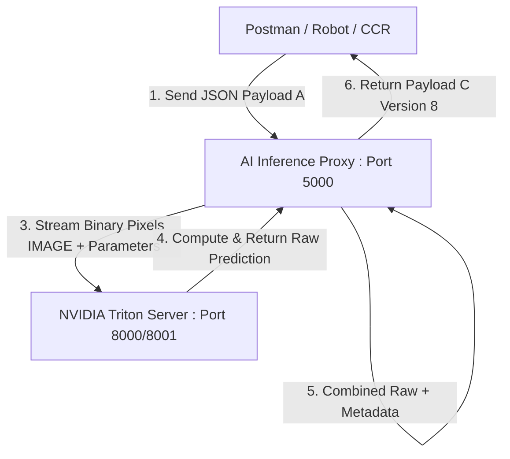

# 🛠️ AI Inference Proxy: Architecture & Implementation Guide

ยินดีต้อนรับสู่คู่มือการทำงานของ **AI Inference Proxy** ซึ่งทำหน้าที่เป็นเลเยอร์ตัวกลาง (Abstraction & Translation Layer) ในการแลกเปลี่ยนข้อมูลระหว่างไคลเอนต์ภายนอก (หุ่นยนต์, CCR, Postman) และ **NVIDIA Triton Inference Server**

---

## 1. ภาพรวมสถาปัตยกรรม (Architecture Overview)

Inference Proxy ได้รับการออกแบบมาเพื่อแยกส่วนควบคุมทางธุรกิจ (Business Logic) ออกจากความต้องการทางเทคนิคของโมเดล AI (Model Infrastructure) ด้วยหลักการ **Loose Coupling** และการส่งข้อมูลประสิทธิภาพสูง:



---

## 2. วงจรชีวิตของข้อมูล (Payload Lifecycle)

การรับส่งข้อมูลในระบบถูกแบ่งออกเป็น 3 รูปแบบ (Schemas) หลักดังนี้:

### 🔹 1. Payload A (Client Request)
เป็นข้อมูลที่ส่งมาจากอุปกรณ์ภายนอก โดยจะส่งเป็น JSON ขนาดเล็กที่มีเพียงพาธรูปภาพ (`image_uri`) และพารามิเตอร์ควบคุมทั่วไป เพื่อประหยัดแบนด์วิธเครือข่าย

```json
{
  "inference_request_id": "0daf3458-5cb1-5494-94aa-b2bd0c4a20f9",
  "timestamp": "2026-03-26T19:20:05.112+07:00",
  "inference_task": 1,
  "inference_payload": "{\"threshold_low\":20,\"threshold_high\":80}",
  "image_uri": "/home/luke/gauge_inspection/images/analog-gauge/ag1.jpg"
}
```

### 🔸 2. Payload B (Internal Data Prep & KServe v2 Protocol)
เมื่อข้อมูลมาถึง Proxy จะทำการประมวลผลล่วงหน้า (Pre-process):
1. **จับคู่ Task ID กับชื่อโมเดล**: แปลง `inference_task: 1` ➡️ `task_analog_gauge_router`
2. **โหลดและแปลงรูปภาพ**: อ่านไฟล์ภาพตาม `image_uri` ผ่าน OpenCV และแปลงภาพเป็นก้อนอาเรย์ตัวเลขพิกเซลดิบ (`np.ndarray`) รูปแบบ `UINT8` ขนาด `[1, 640, 640, 3]`
3. **การแปลงรูปแบบ KServe v2**: ข้อมูลพิกเซลจะถูกบีบอัดและส่งในรูปแบบ **Binary Tensor Data** ไปหา Triton ทาง HTTP Body หรือ gRPC เพื่อเลี่ยงปัญหาคอขวดของการแปลงเป็นข้อความ JSON

### 🔹 3. Payload C (Standardized Response - Version 8 Schema)
เมื่อได้รับผลลัพธ์จากโมเดล Proxy จะจับคู่ข้อมูลย้อนกลับและสร้างเป็น Envelope สรุปผลที่มีคีย์แบบแบนราบ (Flat Object) เพื่อนำไปใช้งานต่อได้ทันที

* **outputs**: ข้อมูลประมวลผลสุดท้าย เช่น `gauge_reading = 22000.0`
* **debug**: ข้อมูลทางคณิตศาสตร์ในการวาดเส้นดีบั๊ก เช่น ค่าความแม่นยำของการฟิตวงกลม (`r2_score`), จุดพิกัดปลายเข็ม (`needle_tip`)

---

## 3. ทำไมต้องมี Proxy? ประโยชน์และแนวคิดการออกแบบ

> [!IMPORTANT]
> **เหตุใดจึงไม่ควรยิงคำขอเข้า Triton Server ตรงๆ จากผู้ใช้งานภายนอก?**

### 1. ประสิทธิภาพของการส่งข้อมูล (Binary Streaming vs JSON Parsing)
หากส่งข้อมูลภาพขนาด 640x640 พิกเซลในรูปแบบข้อความ JSON (พิมพ์ตัวเลขแจกแจงทีละพิกเซลลงใน Body) จะทำให้ได้ไฟล์ JSON ขนาดใหญ่ถึง **4 - 6 MB** ซึ่งทำให้เปลือง CPU ในการคอมไพล์ข้อความสตริงอย่างมาก แต่ Proxy จะเปลี่ยนภาพเป็น **Raw Binary Stream (ขนาดคงที่เพียง ~1.2 MB)** และส่งต่อให้ Triton ทันที ทำให้ประมวลผลเร็วขึ้นหลายเท่าตัว

### 2. การซ่อนสถาปัตยกรรมภายใน (Decoupling & Abstraction)
* หากในอนาคตคุณอัปเกรดโมเดลเกจวัดจากตัวแบ่งส่วนแบบ ONNX ไปเป็น **TensorRT Engine** หรือเปลี่ยนขนาดภาพ Input จาก `640` เป็น `1024` 
* **ไคลเอนต์ภายนอกไม่ต้องแก้ไขโค้ดเลยแม้แต่บรรทัดเดียว** เนื่องจากพวกเขายังคงคุยกับ Proxy ผ่านมาตรฐาน Payload A แบบเดิม ส่วนการสเกลรูปภาพหรือการแปลงชื่อพารามิเตอร์ใหม่จะถูกจัดการที่จุดเดียวใน Proxy

### 3. ระบบความปลอดภัย (Security Layer)
Triton Server ไม่ได้ถูกออกแบบมาให้มีระบบ Authentication หรือการกรองทราฟฟิก (Traffic Filtering) ในตัว การวาง Proxy (เช่น Flask/FastAPI) กั้นกลางไว้ จะช่วยควบคุมสิทธิ์การเข้าถึง และสกัดกั้นข้อมูลที่ไม่ถูกต้องก่อนส่งถึงการ์ดจอ GPU

---

## 4. วิธีการรันใช้งานและทดสอบ (Running & Testing)

### 🚀 การรันเปิดบริการแบบ Server (HTTP Web API)
ใช้คำสั่งนี้เพื่อเปิดพอร์ต `5000` ให้ระบบภายนอกหรือ Postman สามารถยิงคำขอเข้ามาทดสอบได้:
```bash
python3 inference_proxy/triton_integrated_client.py --server
```

### 🧪 การรันชุดทดสอบความถูกต้องแบบจำลอง (Integration Test)
รันชุดทดสอบครอบคลุมภารกิจ Task ID 0 ถึง 5 เพื่อบันทึกผลลัพธ์ลงในโฟลเดอร์ `results/mock_tests/`:
```bash
python3 inference_proxy/test_all_tasks_mock.py
```
