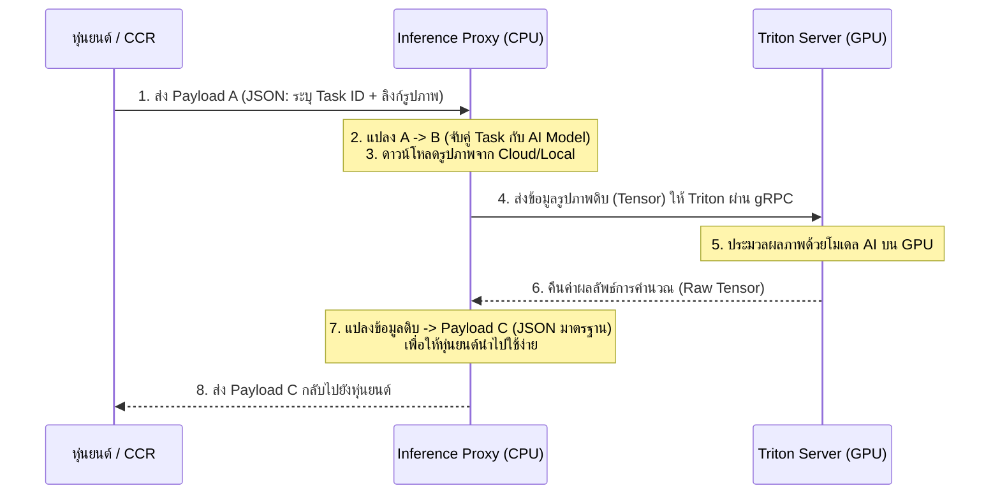

# 🧠 NVIDIA Triton Server & AI System Architecture Overview

เอกสารฉบับนี้อธิบายโครงสร้างสถาปัตยกรรม (Architecture) ของระบบประมวลผลปัญญาประดิษฐ์ (AI Inference System) ที่ออกแบบมาเพื่อรองรับงานระดับ Production (Enterprise-grade) โดยมีหัวใจหลักคือ **NVIDIA Triton Inference Server** ร่วมกับ **AI Inference Proxy**

---

## 📌 สารบัญ (Table of Contents)

1. [1. ภาพรวมของระบบ (System Overview)](#1-ภาพรวมของระบบ-system-overview)
2. [2. รูปแบบการสื่อสารและการไหลของข้อมูล (Communication Flow)](#2-รูปแบบการสื่อสารและการไหลของข้อมูล-communication-flow)
3. [3. ทำไมต้องมี Inference Proxy? (The Necessity of Inference Proxy)](#3-ทำไมต้องมี-inference-proxy-the-necessity-of-inference-proxy)
4. [4. การเชื่อมต่อข้อมูลคลังโมเดลด้วย Docker Volume Mounting](#4-การเชื่อมต่อข้อมูลคลังโมเดลด้วย-docker-volume-mounting)
5. [5. โครงสร้างคลังโมเดลระดับสเกลใหญ่ (Super Scale Model Repository)](#5-โครงสร้างคลังโมเดลระดับสเกลใหญ่-super-scale-model-repository)
6. [6. เจาะลึกโครงสร้างภายในของ NVIDIA Triton (Triton Internal Architecture Deep-Dive)](#6-เจาะลึกโครงสร้างภายในของ-nvidia-triton-triton-internal-architecture-deep-dive)
7. [7. คลังฟีเจอร์เด่นระดับโลกของ NVIDIA Triton (NVIDIA Triton 10 Major Features)](#7-คลังฟีเจอร์เด่นระดับโลกของ-nvidia-triton-nvidia-triton-10-major-features)
8. [8. ความปลอดภัยและความเป็นส่วนตัวของข้อมูล (Data Privacy & Security)](#8-ความปลอดภัยและความเป็นส่วนตัวของข้อมูล-data-privacy--security)
9. [9. การรองรับหุ่นยนต์ลาดตระเวนจำนวนมาก (Scaling for Dozens of Patrolling Robots)](#9-การรองรับหุ่นยนต์ลาดตระเวนจำนวนมาก-scaling-for-dozens-of-patrolling-robots)

---

## 1. ภาพรวมของระบบ (System Overview)

ระบบถูกออกแบบด้วยสถาปัตยกรรมแบบ **Microservices** โดยแบ่งหน้าที่การทำงานออกเป็น 2 ส่วนหลัก เพื่อให้เกิดประสิทธิภาพสูงสุด (แยกภาระงานระหว่าง CPU และ GPU ออกจากกันอย่างเด็ดขาด)

*   **AI Inference Proxy (API Gateway):** ทำหน้าที่เป็น "พนักงานต้อนรับ" คอยรับคำสั่งจากหุ่นยนต์ จัดการเตรียมข้อมูล และจัดรูปแบบผลลัพธ์ (รันบน CPU)
*   **NVIDIA Triton Server (AI Engine):** ทำหน้าที่เป็น "สมองกล" ที่รับข้อมูลภาพถ่ายดิจิทัลและตารางอาเรย์ที่เตรียมไว้เรียบร้อยแล้ว มาประมวลผลผ่านโมเดล AI บนหน่วยความจำการ์ดจอ (GPU) ด้วยความเร็วสูงสุด

---

## 2. รูปแบบการสื่อสารและการไหลของข้อมูล (Communication Flow)

การสื่อสารระหว่างหุ่นยนต์ตรวจตราและระบบประมวลผล AI ถูกกำหนดเป็นมาตรฐานข้อมูล 3 ระยะ (Payload A, B, C) เพื่อความเป็นระบบและความสะดวกในการขยายขอบเขตงานในอนาคต



---

## 3. ทำไมต้องมี Inference Proxy? (The Necessity of Inference Proxy)

แม้ว่าระบบจะสามารถส่งข้อมูล Payload B ไปยัง Triton โดยตรงได้ แต่การมี **Inference Proxy** คั่นกลาง ถือเป็น Best Practice ที่สำคัญอย่างยิ่งในระดับอุตสาหกรรม ด้วยเหตุผลหลัก 3 ข้อดังนี้:

1.  **ลดคอขวดของหน่วยประมวลผล (Preventing I/O Bottlenecks):** 
    Triton ถูกออกแบบมาเพื่อรีดพลังคำนวณของ GPU หากเราให้ Triton ทำหน้าที่ดาวน์โหลดรูปภาพจาก S3 หรือ Cloud Storage ตัวการ์ดจอจะต้องหยุดทำงานเพื่อรอข้อมูล (Block) การมี Proxy ช่วยให้ CPU จัดการโหลดภาพให้เสร็จสมบูรณ์ก่อนส่งให้ GPU ทำให้ GPU ทำงานคำนวณได้อย่างต่อเนื่อง 100%
2.  **ความง่ายฝั่งผู้ใช้งาน (Strict Client Separation):**
    Triton บังคับโครงสร้าง API ที่เข้มงวดและรับส่งข้อมูลในรูปอาเรย์ตัวเลขดิบ (Tensor) ซึ่งปั้นข้อมูลยากสำหรับหุ่นยนต์หรือแอปพลิเคชันหน้าบ้าน การมี Proxy ช่วยทำหน้าที่รับ JSON ธรรมดาๆ จากหุ่นยนต์ แล้วปั้นข้อมูลเข้าระบบ Triton ให้โดยอัตโนมัติ
3.  **การควบคุมตรรกะทางธุรกิจ (Business Logic Isolation):**
    การแปลงผลลัพธ์ของ AI ให้ออกมาเป็นฟอร์แมตมาตรฐาน Payload C เวอร์ชันล่าสุดไม่จำเป็นต้องใช้พลังของ GPU การแยกตรรกะนี้มาไว้ที่ Proxy ช่วยประหยัด RAM การ์ดจอ และสลับเปลี่ยนสคริปต์ได้ง่ายโดยไม่ต้องรีสตาร์ทตัวระบบ AI หลัก

---

## 4. การเชื่อมต่อข้อมูลคลังโมเดลด้วย Docker Volume Mounting

NVIDIA Triton จะทำงานภายในระบบปิดที่มีความเสถียรสูง (Docker Container) แต่ไฟล์โมเดล AI ทั้งหมดจะจัดเก็บอยู่บนเครื่องหลักของเซิร์ฟเวอร์ (Host) 

การแชร์ไฟล์ระหว่างเซิร์ฟเวอร์หลักและ Triton ใช้เทคนิค **"Docker Volume Mounting"** เพื่อเชื่อมโยงโฟลเดอร์โดยตรง

```bash
# ตัวอย่างคำสั่งการเชื่อมโยงระบบ
docker run --gpus all \
  -v /home/luke/gauge_inspection/triton_project/model_repository:/models \
  nvcr.io/nvidia/tritonserver:23.08-py3 \
  tritonserver --model-repository=/models
```

### ประโยชน์เชิงธุรกิจ:
*   **อัปเดตโมเดลแบบไร้รอยต่อ (Hot Swap / Zero Downtime):** หากทีมพัฒนา AI ทำโมเดลตัวใหม่ที่แม่นยำกว่าเดิม สามารถนำไปวางทับในคลังโมเดลบนเครื่องหลักได้ทันที Triton จะตรวจพบไฟล์ใหม่และโหลดเข้าหน่วยความจำอัตโนมัติโดยไม่ต้องปิดหรือรีสตาร์ทบริการหลังบ้าน
*   **บำรุงรักษาง่าย (Ease of Maintenance):** ไม่ต้องเสียเวลาสร้างหรือทำซ้ำ Docker Image ใหม่ทุกครั้งที่ปรับแต่งโค้ด

---

## 5. โครงสร้างคลังโมเดลระดับสเกลใหญ่ (Super Scale Model Repository)

เพื่อให้เซิร์ฟเวอร์ AI รองรับหลากหลายภารกิจและประหยัดเนื้อที่การ์ดจอ คลังเก็บโมเดลจึงถูกออกแบบโครงสร้างเป็น **"โครงสร้างแนวราบ (Flat Structure)"** เพื่อให้ Triton ตรวจจับได้อัตโนมัติโดยไม่เกิดการซ้อนทับของโฟลเดอร์:

1.  **Task Orchestrators (ตัวจัดการลำดับงาน):** ทำหน้าที่เสมือน "ผู้จัดการงาน" เช่น `task_analog_gauge_router` หรือ `task_gas_router` ทำหน้าที่กำหนดลำดับขั้นตอนและสูตรคำนวณของงานประเภทนั้นๆ
2.  **Shared Backbones (โมเดลส่วนกลางประหยัด VRAM):** เปรียบเสมือน "เครื่องมือเฉพาะทาง" เช่น โมเดลแบ่งส่วนภาพ (YOLO) หรือโมเดลอ่านอักษร (OCR) ที่เปิดโอกาสให้ผู้จัดการงานหลายภารกิจสามารถวิ่งมาเรียกใช้ร่วมกันได้

> [!NOTE]
> การใช้โครงสร้าง Shared Backbone ช่วยประหยัดพื้นที่ VRAM บนการ์ดจอได้อย่างมหาศาล เพราะโมเดลกลางจะถูกโหลดขึ้นหน่วยความจำเพียงครั้งเดียว แต่พร้อมประมวลผลให้ทุกงานที่เรียกเข้ามา

---

## 6. เจาะลึกโครงสร้างภายในของ NVIDIA Triton (Triton Internal Architecture Deep-Dive)

หัวข้อนี้อธิบายโครงสร้างภายในและการเดินทางของข้อมูลตามแผนภาพมาตรฐานสากลของ NVIDIA Triton ตั้งแต่ต้นจนจบ:

```
[ ชั้นบนสุด: Client Application & Libraries ]
                  │
[ ช่องทางสื่อสาร: HTTP / gRPC / C API (Direct) ]
                  │
[ ระบบจัดคิว: Inference Request -> Scheduler Queues ]
                  │
[ แกนประมวลผล: Framework Backends (TensorRT/ONNX/PyTorch) ]
                  │
[ ชั้นล่างสุด: Hardware Execution (GPU / CPU) ]
```

### 6.1 ฝั่งผู้เรียกใช้งานภายนอก (External Client Layer)
*   **Client Application (แอปพลิเคชันไคลเอนต์):** โปรแกรมปลายทาง เช่น ตัวซอฟต์แวร์ของหุ่นยนต์ลาดตระเวน หรือหน้าจอแดชบอร์ดควบคุมระบบ
*   **Python/C++ Client Library (ไลบรารีสำหรับนักพัฒนา):** ชุดคำสั่งสำเร็จรูป (SDK) ที่ NVIDIA จัดเตรียมไว้ให้เพื่อสะดวกต่อการพัฒนาแอปพลิเคชันส่งรูปเข้าเซิร์ฟเวอร์
*   **HTTP / gRPC (ช่องทางการส่งข้อมูล):**
    *   **HTTP (Port 8000):** เหมาะสำหรับการเรียกใช้งานทั่วไป สะดวก ใช้ง่าย
    *   **gRPC (Port 8001):** เหมาะสำหรับโปรดักชันที่ต้องการความเร็วสูงมาก ส่งข้อมูลเป็น Binary ขนาดเล็ก ช่วยประหยัด Network แบนด์วิดท์

### 6.2 ด่านควบคุมและจัดสรรคลัง (API & Control Layer)
*   **C API (อินเทอร์เฟซ C ระดับล่างสุด):** สำหรับเคสความเร็วสูงระดับสายฟ้าฟาด (เช่น การยิง AI บนหุ่นยนต์ประมวลผลในตัวเอง) แอปพลิเคชันสามารถลิงก์ตรงหา C API โดยไม่ต้องสร้าง Network Port ใดๆ เลย ช่วยขจัดปัญหาความล่าช้าในเครือข่ายเป็นศูนย์
*   **Model Repository (Persistent Volume) (คลังเก็บโมเดลถาวร):** แหล่งจัดเก็บไฟล์และโครงสร้างโมเดล AI ทั้งหมดบน Harddisk/SSD ของเครื่องแม่ข่าย
*   **Model Management (ระบบจัดการโมเดล):** สมองกลส่วนกลางทำหน้าที่สแกน ติดตั้ง สับเปลี่ยนเวอร์ชัน หรือถอดถอนโมเดล AI ตลอดเวลาการรันระบบ

### 6.3 ระบบรับส่งตรรกะคิวและการประมวลผล (Scheduler & Frameworks Layer)
*   **Inference Request (คำร้องขอประมวลผล):** ข้อมูลรูปภาพหรือพิกัดที่วิ่งเข้ามาทางด่านควบคุมเพื่อรอการแปลงผล
*   **Per-Model Scheduler Queues (คิวงานรายโมเดล):** คิวรอแยกเฉพาะของแต่ละงาน เพื่อป้องกันโมเดลที่งานหนาแน่นไปส่งผลกระทบต่อโมเดลตัวอื่นในระบบ
*   **Scheduler (ตัวจัดระเบียบตารางงาน):** ทำหน้าที่ตรวจสอบและจัดคิว ส่งข้อมูลไปทำ Dynamic Batching เพื่อเตรียมส่งให้การ์ดจอคำนวณ
*   **Framework Backends (ตัวขับเคลื่อน AI):** แกนแปลงผลลัพธ์ของโมเดลแต่ละประเภทอย่างครอบคลุม:
    *   **TensorRT:** เร็วที่สุด พัฒนามาเพื่อรีดพลังฮาร์ดแวร์ NVIDIA โดยเฉพาะ
    *   **TensorFlow / PyTorch:** สองค่ายยักษ์ใหญ่ยอดนิยมของฝั่งปัญญาประดิษฐ์
    *   **ONNX:** มาตรฐานไฟล์เชื่อมโยงของโมเดล AI ทั่วโลก
    *   **Custom:** สำหรับเขียนตรรกะประมวลผลเพิ่มเติมตามที่ธุรกิจต้องการ (เช่น Python Backend)
*   **Inference Response (การตอบกลับผลลัพธ์):** การแพ็กข้อมูลผลลัพธ์ที่คำนวณเสร็จสิ้นเรียบร้อยแล้ว ส่งคืนกลับไปให้ผู้ใช้งานทางพอร์ตเดิม

### 6.4 หน่วยฮาร์ดแวร์ประมวลผลหลัก (Hardware Layer)
*   **GPU (หน่วยประมวลผลกราฟิก):** การ์ดจอโปรดักชัน (เช่น A6000) ทำหน้าที่รับภาพไปประมวลผลแบบขนานด้วยความเร็วสูง
*   **CPU (หน่วยประมวลผลกลาง):** จัดการเรื่องระบบการต่อคิว, Network, โค้ดคณิตศาสตร์ และคุมสุขภาพเซิร์ฟเวอร์โดยรวม

---

## 7. คลังฟีเจอร์เด่นระดับโลกของ NVIDIA Triton (NVIDIA Triton 10 Major Features)

สรุป 10 ฟีเจอร์ที่ยอดเยี่ยมที่สุดของ Triton ที่นำมาขับเคลื่อนให้ระบบนี้เป็นระบบระดับโลก:

1.  **Supports Multiple Deep Learning Frameworks (รองรับค่ายปัญญาประดิษฐ์ชั้นนำทั้งหมด):** ยืดหยุ่นสูงสุดด้วยการสนับสนุน PyTorch, TensorFlow, TensorRT และ ONNX คู่ขนานกันในเครื่องเดียว
2.  **Supports Multiple Machine Learning Frameworks (รองรับตรรกะคลาสสิก):** สนับสนุนแบบจำลองดั้งเดิม เช่น XGBoost, LightGBM และ Scikit-learn ผ่านไลบรารี FIL ช่วยประมวลผลข้อมูลสถิติตัวเลขได้ทันที
3.  **Concurrent Model Execution (การรัน AI คู่ขนานระดับวินาที):** ความสามารถในการสั่งให้ GPU คำนวณภาพจากโมเดลหลายตัวไปพร้อมๆ กันเพื่อประสิทธิภาพการใช้การ์ดจอ 100%
4.  **Dynamic Batching (มัดรวมคำสั่งอัตโนมัติ):** ระบบรวบภาพจากคำร้องขอที่วิ่งเข้ามาพร้อมกันในเสี้ยววินาทีเพื่อส่งประมวลผลพร้อมกันในครั้งเดียว ช่วยเพิ่มความคุ้มค่าของการใช้การ์ดจอได้ 3-5 เท่า
5.  **Sequence Batching & Implicit State Management (รองรับวิดีโอต่อเนื่องและเสียง):** จำสถานะความสัมพันธ์เชิงเวลาระหว่างภาพ (Time-series) เหมาะสำหรับการทำระบบตรวจจับวิดีโอลาดตระเวน (Video Analytics)
6.  **Backend API for Custom Operations (สถาปัตยกรรมเปิด):** เปิดให้นักพัฒนาเขียนสคริปต์เสริมเพื่อจัดการข้อมูลก่อนหรือหลังส่งเข้า AI ได้ เช่น ตรรกะสมการฟิสิกส์คํานวณมุมเข็มเกจ
7.  **Model Pipelines using Ensembling or BLS (ระบบท่อส่งต่องาน):** รองรับระบบท่อส่งต่อข้อมูลไร้รอยต่อ เช่น การรับภาพ -> ตรวจจับเกจ -> ส่งพิกัดเกจไปอ่านเข็ม -> คายผลลัพธ์ โดยจัดทำบนการ์ดจอทั้งหมดผ่าน BLS (Business Logic Scripting)
8.  **HTTP/REST and gRPC Protocols based on KServe (มาตรฐานความเข้ากันได้ระดับคลาวด์):** รูปแบบการเชื่อมโยงระบบอ้างอิงตามสถาปัตยกรรมสากล KServe v2 รองรับการย้ายขึ้นคลาวด์หรือระบบ Kubernetes ขององค์กรได้ทันที
9.  **C API & Java API for In-Process Use Cases (การฝังตัวประมวลผลระดับฮาร์ดแวร์):** รองรับการยัดระบบ Triton เข้าไปรันอยู่ใต้ซอฟต์แวร์ฝั่งหุ่นยนต์เพื่อใช้งานออฟไลน์ความเร็วสูงสุดแบบไร้สายสัญญาณรบกวน
10. **Metrics for Observability (ระบบรายงานสุขภาพเชิงลึก):** รายงานความฟิตของ GPU และอัตราความเร็ว (Throughput/Latency) ตลอด 24 ชั่วโมง เพื่อให้ฝั่ง IT ติดตามสุขภาพระบบได้ง่าย

---

## 8. ความปลอดภัยและความเป็นส่วนตัวของข้อมูล (Data Privacy & Security)

สำหรับโครงการระดับองค์กรขนาดใหญ่ (Enterprise) ความปลอดภัยของข้อมูลปฏิบัติงานจริงในพื้นที่คือหัวใจสำคัญสูงสุด ซึ่งสถาปัตยกรรมของเราปกป้องข้อมูลด้วย 5 กลไกหลัก:

*   **8.1 100% On-Premise & Air-Gapped Deployment (ปิดประตูรั้วข้อมูล):** ระบบทั้งหมดสามารถรันแบบออฟไลน์อย่างสมบูรณ์ภายในอินทราเน็ตและดาต้าเซ็นเตอร์ของลูกค้า (Data Sovereignty) ข้อมูลไม่มีการรั่วไหลออกสู่อินเทอร์เน็ตภายนอก 100%
*   **8.2 API Gateway & Attack Isolation (ระบบป้อมยามคัดกรองภัย):** Triton ทำงานอยู่ในเครือข่ายชั้นในสุด โดยมี Inference Proxy ยืนอยู่ชั้นนอกคอยกลั่นกรองคำสั่งรูปภาพและสกัดกั้นการแฮกหรือการโจมตีทางเครือข่ายก่อนจะส่งข้อมูลถึงการ์ดจอหลัก
*   **8.3 Token-Based Authentication (ระบบคัดกรองยืนยันตัวตน):** บนตัว Inference Proxy สามารถเปิดใช้งานระบบยืนยันสิทธิ์ขั้นสูง (JWT, API Keys) เพื่อตรวจสอบว่ามีเฉพาะหุ่นยนต์ตรวจการที่ได้รับอนุญาตเท่านั้นที่ยิงภาพเข้าประมวลผลได้
*   **8.4 In-Memory Processing & Auto-Purging (ประมวลผลเสร็จลบข้อมูลทิ้งทันที):** การทำงานประมวลผลภาพถ่ายเกิดขึ้นบนหน่วยความจำชั่วคราว (RAM/VRAM) ทันทีที่แปลงผลลัพธ์สำเร็จและส่งมอบให้หุ่นยนต์ ข้อมูลภาพจะถูกเคลียร์ทิ้งทันทีโดยไม่มีการเขียนลง Harddisk เพื่อป้องกันการแฮกประวัติภาพย้อนหลัง
*   **8.5 Docker Container Sandbox (ตู้จำกัดความเสียหาย):** ทั้งสองบริการรันอยู่ภายใน Sandbox ของ Docker Container แยกขาดจากระบบปฏิบัติการหลัก หากสคริปต์จุดใดมีปัญหา จะไม่สามารถเข้าถึงไฟล์ระบบอื่นๆ บนเครื่องแม่ข่ายได้เลย

---

## 9. การรองรับหุ่นยนต์ลาดตระเวนจำนวนมาก (Scaling for Dozens of Patrolling Robots)

เมื่อระบบขยายขนาดขึ้นจริงจนมี **หุ่นยนต์ลาดตระเวนหลายสิบตัว (เช่น 30-50 ตัว)** วิ่งส่งสัญญาณภาพเข้ามาประมวลผลพร้อมๆ กัน สถาปัตยกรรมระดับนี้สามารถรับมือโหลดได้อย่างลื่นไหลไร้รอยต่อ ผ่าน 4 กลไกการขยายระบบ:

```
[ หุ่นยนต์ 30+ ตัว ] ──ส่งพร้อมกัน──► [ Load Balancer (NGINX) ]
                                            │
                                  ┌─────────┴─────────┐
                                  ▼                   ▼
                       [ Inference Proxy 1 ]   [ Inference Proxy 2 ]
                                  │                   │
                                  └─────────┬─────────┘ (คุยผ่าน gRPC)
                                            ▼
                                  [ NVIDIA Triton (GPU) ]
                                    (Dynamic Batching)
```

*   **9.1 Horizontal Scaling of Inference Proxy (กระจายภาระงานด้วย CPU):**
    ตัว Inference Proxy มีน้ำหนักเบาและเน้นประมวลผลด้วย CPU หากมีหุ่นยนต์ลาดตระเวนเยอะขึ้น เราสามารถเพิ่มจำนวนตู้คอนเทนเนอร์ของ Proxy เป็น 2-3 ตัว แล้วติดตั้ง Load Balancer (เช่น NGINX) เพื่อกระจายคำร้องขอได้ทันที ช่วยลดความหน่วงในเครือข่าย
*   **9.2 Dynamic Batching on Triton GPU (มัดรวมมวลสารประมวลผลขนาน):**
    หากหุ่นยนต์ 10 ตัวส่งภาพเข้ามาในเสี้ยววินาทีเดียวกัน ตัวจัดระเบียบตารางงานของ Triton จะทำ Dynamic Batching เพื่อรวบภาพเกจทั้ง 10 รูปเข้าการ์ดจอประมวลผลขนานไปพร้อมๆ กันในคราวเดียว ทำให้ความหน่วงเวลารวมในการประมวลผลใกล้เคียงกับการประมวลผลภาพถ่ายภาพเดียว
*   **9.3 Model Instance Groups (สับคิวทำงานทันใจ):**
    โมเดลที่มีปริมาณการเรียกใช้งานบ่อยครั้ง เช่น โมเดลระบุวัตถุ (YOLO) สามารถปั๊มจำนวน Instance ขึ้นมารอบน VRAM ได้ 2-3 ชุด หาก Instance ตัวที่ 1 กำลังติดพันงานจากหุ่นยนต์ A อยู่ ตัว Triton จะป้อนภาพหุ่นยนต์ B เข้าไปที่ Instance ตัวที่ 2 ทันทีโดยไม่ต้องรอ
*   **9.4 Prioritized Queuing (คิวปลอดภัยเร่งด่วน):**
    ระบบเปิดการกำหนดสิทธิ์จัดลำดับ เช่น เหตุการณ์ก๊าซรั่วหรือไฟไหม้ (Priority 1) จะได้รับการลัดคิวเข้ามาประมวลผลบนการ์ดจอทันทีเพื่อทำการแจ้งเตือนภัยวิกฤต และจะปล่อยให้ระบบประมวลผลอ่านค่าเกจทั่วไป (Priority 2) ทำงานถัดไปในระดับมิลลิวินาที
